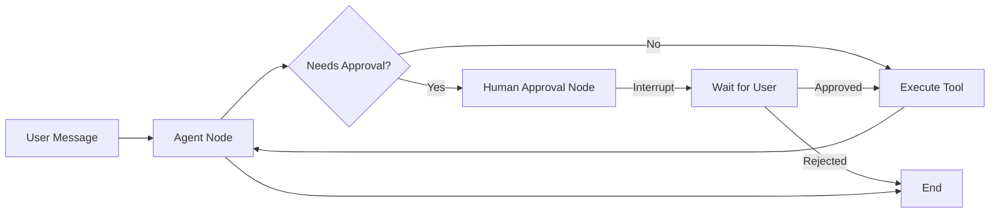

# FastMCP + McpUI + CopilotKit Integration

A full-stack application for managing MCP (Model Context Protocol) servers with LangGraph human-in-the-loop approval workflow and an interactive chat interface.

## 🎯 Features

- **MCP Management**: Import and manage MCP configurations (SSE and stdio protocols)
- **Dynamic Tool Loading**: Automatically discover and register tools from MCPs
- **Human-in-the-Loop**: LangGraph workflow with approval gates for sensitive operations
- **Real-time Chat**: SSE-based streaming chat interface
- **Beautiful UI**: Modern React interface with Tailwind CSS

## 📁 Project Structure

```
.
├── backend/                    # FastAPI backend
│   ├── core/                  # Core configuration
│   │   └── config.py         # Settings management
│   ├── models/               # Pydantic models
│   │   └── schemas.py        # API schemas
│   ├── routes/               # API endpoints
│   │   ├── mcp.py           # MCP management routes
│   │   └── chat.py          # Chat routes
│   ├── services/            # Business logic
│   │   ├── mcp_manager.py   # MCP lifecycle management
│   │   └── chat_service.py  # LangGraph chat service
│   └── main.py              # FastAPI app entry point
├── frontend/                # Next.js frontend
│   ├── app/                # Next.js app directory
│   ├── components/         # React components
│   │   ├── McpImporter.tsx    # MCP import UI
│   │   ├── McpList.tsx        # MCP list display
│   │   └── ChatInterface.tsx  # Chat interface
│   └── lib/                # Utilities
│       └── api.ts          # API client
└── examples/              # Example MCP configurations
```

## 🚀 Setup

### Backend Setup

1. **Install dependencies** (using Poetry):
```bash
cd backend
pip install poetry
poetry install
```

2. **Configure environment**:
```bash
cp .env.example .env
# Edit .env and add your OpenAI API key
```

3. **Run the backend**:
```bash
poetry run python -m backend.main
# Or with uvicorn directly:
poetry run uvicorn backend.main:app --reload --host 0.0.0.0 --port 8000
```

### Frontend Setup

1. **Install dependencies**:
```bash
cd frontend
npm install
```

2. **Run the development server**:
```bash
npm run dev
```

3. **Open your browser**:
Navigate to [http://localhost:3000](http://localhost:3000)

## 📖 Usage

### Importing an MCP

1. **Via JSON Input**:
   - Select protocol (SSE or stdio)
   - Paste MCP configuration JSON
   - Click "Import from JSON"

2. **Via File Upload**:
   - Click "Upload JSON file"
   - Select a JSON file containing MCP configuration

### Example MCP Configurations

See `examples/` directory for sample configurations:
- `mcp-weather-sse.json` - SSE-based weather API
- `mcp-database-stdio.json` - stdio-based database tools

### Chatting with MCPs

1. Ensure at least one MCP is loaded
2. Type your message in the chat input
3. If a tool requires approval, you'll see an approval dialog
4. Click "Approve" or "Reject" to continue

## 🔧 Configuration

### Backend (.env)

```env
BACKEND_HOST=0.0.0.0
BACKEND_PORT=8000
FRONTEND_URL=http://localhost:3000
OPENAI_API_KEY=your_key_here
OPENAI_MODEL=gpt-4-turbo-preview
MCP_STORAGE_PATH=./mcp_data
```

### Frontend (.env.local)

```env
NEXT_PUBLIC_API_URL=http://localhost:8000
```

## 🏗️ Architecture

### Backend

- **FastAPI**: Web framework for building APIs
- **FastMCP**: MCP protocol implementation
- **LangChain**: LLM orchestration
- **LangGraph**: State machine for human-in-the-loop workflows
- **SSE-Starlette**: Server-Sent Events for real-time streaming

### Frontend

- **Next.js 14**: React framework with App Router
- **TypeScript**: Type safety
- **Tailwind CSS**: Utility-first CSS framework
- **Lucide React**: Beautiful icons

### Human-in-the-Loop Workflow



## 🎨 UI Components

- **McpImporter**: Import MCP configurations
- **McpList**: Display and manage loaded MCPs
- **ChatInterface**: Interactive chat with SSE streaming

## 📝 API Endpoints

### MCP Management

- `POST /api/mcp/import` - Import MCP from JSON
- `POST /api/mcp/import/file` - Import MCP from file
- `GET /api/mcp/list` - List all loaded MCPs
- `GET /api/mcp/{mcp_id}` - Get MCP details
- `DELETE /api/mcp/{mcp_id}` - Unload MCP
- `GET /api/mcp/{mcp_id}/tools` - Get MCP tools

### Chat

- `POST /api/chat/stream` - Stream chat with SSE
- `POST /api/chat/approve` - Approve/reject pending action
- `GET /api/chat/history/{thread_id}` - Get chat history

## 🧪 Testing

```bash
# Backend tests
cd backend
poetry run pytest

# Frontend tests
cd frontend
npm run test
```

## 📄 License

MIT

## 🤝 Contributing

Contributions welcome! Please open an issue or PR.
