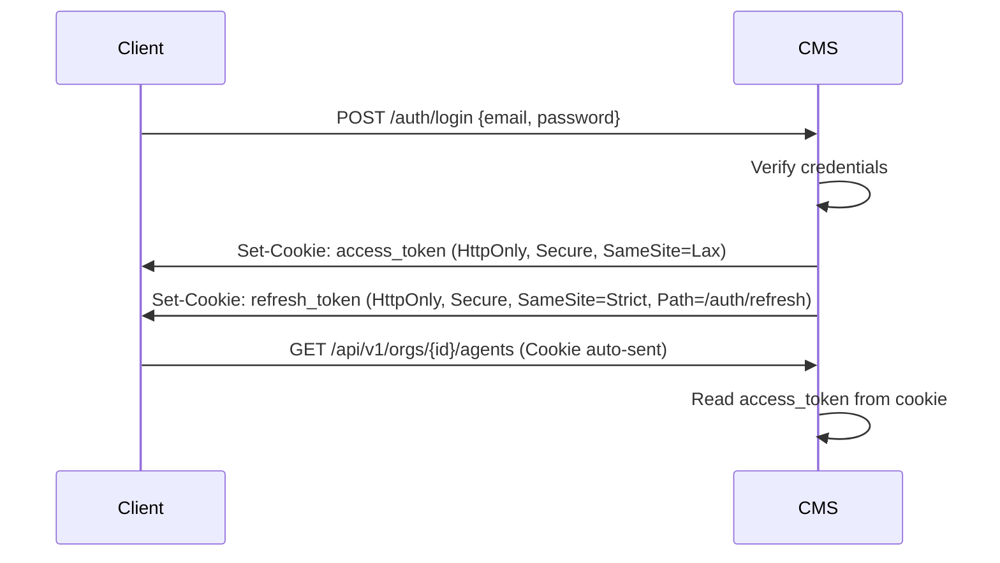
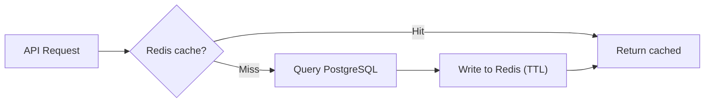
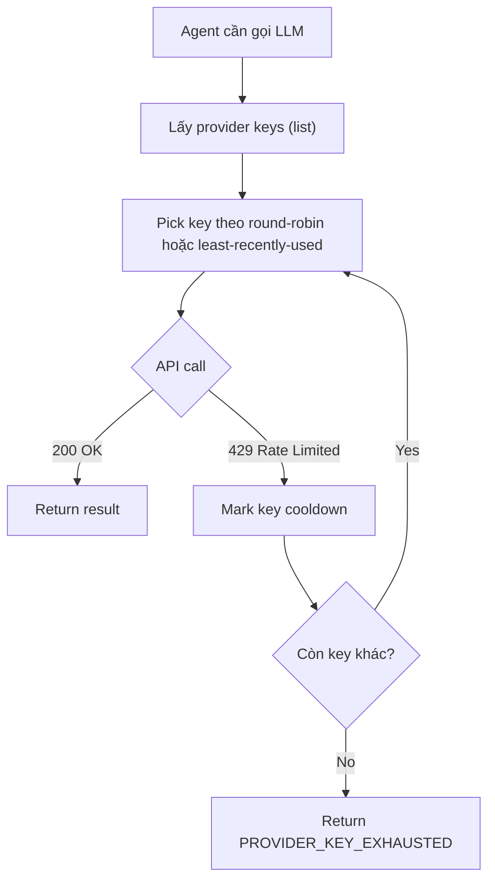
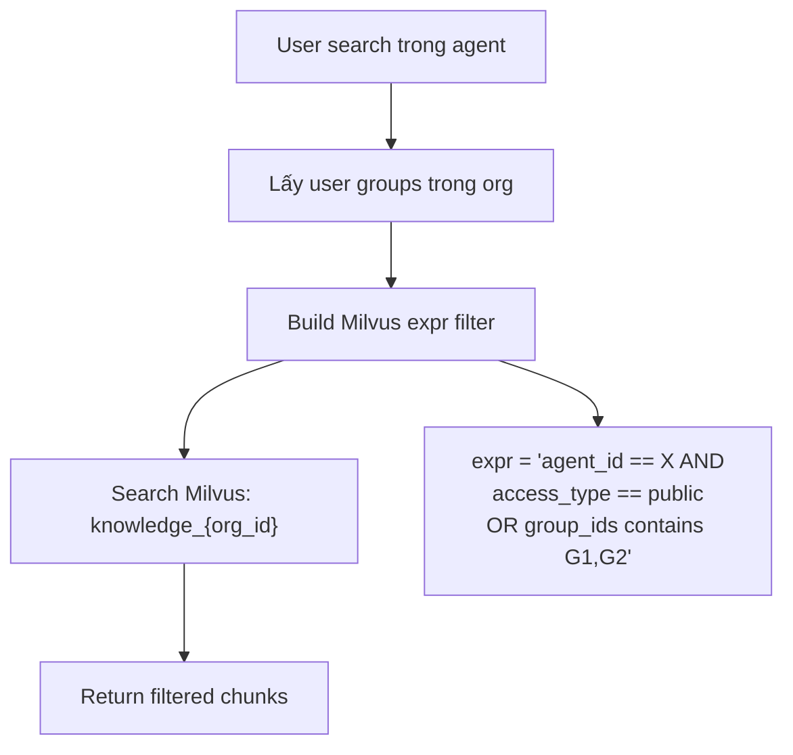
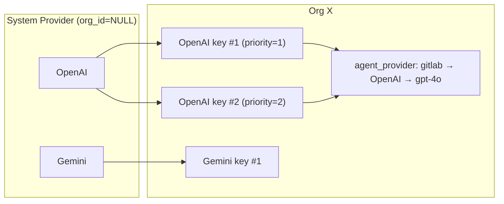
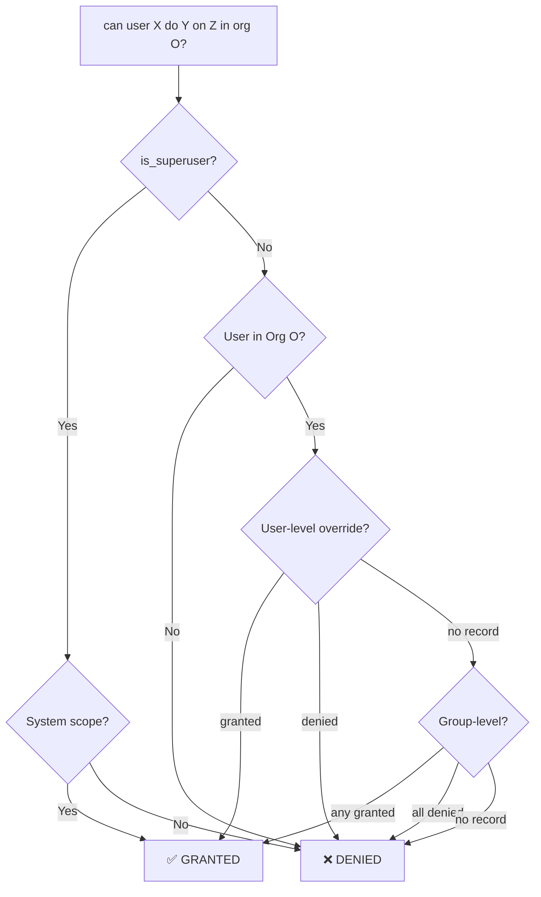

# CMS Backend — SRS & Implementation Plan v4

## 1. Tổng quan

CMS backend đa tổ chức cho hệ thống multi-agent tại `multi-agent/backend/`. Quản lý user, RBAC, agent, MCP, tool, provider — phân tách **System scope** (root) và **Tenant scope** (org).

### Nguyên tắc

| # | Nguyên tắc |
|---|---|
| 1 | **Tenant isolation tuyệt đối** — superuser KHÔNG truy cập tenant data |
| 2 | **Group = Role** — không có bảng roles riêng |
| 3 | **System vs Tenant agents** — system global on/off, tenant tự tạo |
| 4 | **JWT HttpOnly Cookie** — không dùng Firebase |
| 5 | **Invite-only** — không self-register, admin mời user qua invite flow |
| 6 | **Token blacklist = Redis TTL** — không dùng DB table, Redis SETEX với TTL = token lifetime |
| 7 | **Error codes** — HTTPException trả mã code, frontend map locale |
| 8 | **Redis-first cache** — query Redis trước DB (read-through) |
| 9 | **Key rotation** — provider keys là list, xoay vòng tránh 429 |
| 10 | **Knowledge by permission** — retrieval filter theo group, Milvus expr |
| 11 | **Router = thin layer** — KHÔNG viết schema, business logic, DB query trong router |
| 12 | **TTL tập trung** — KHÔNG hardcode TTL/expire. Tất cả TTL trong `settings.py` |
| 13 | **Cache invalidation cascading** — Mutation phải clear tất cả cache liên quan |
| 14 | **Schema riêng file** — Mỗi resource có file schema riêng trong `schemas/` |
| 15 | **Service singleton** — Export `svc = Service()` cuối file |
| 16 | **Frontend datetime UTC** — Backend lưu UTC, frontend dùng `lib/datetime.ts` convert |
| 17 | **json.dumps(default=str)** — Redis chỉ lưu raw string, CacheService serialize |

---

## 2. Cross-cutting Concerns

### 2.1 Error Response Format

Tất cả HTTPException trả JSON với `error_code` để frontend map i18n:

```json
{
  "error_code": "AUTH_INVALID_CREDENTIALS",
  "detail": "Invalid email or password",
  "status_code": 401
}
```

Error code convention: `{DOMAIN}_{ACTION}` — ví dụ:
- `AUTH_INVALID_CREDENTIALS`, `AUTH_TOKEN_EXPIRED`, `AUTH_FORBIDDEN`
- `ORG_NOT_FOUND`, `ORG_MEMBERSHIP_REQUIRED`
- `PERMISSION_DENIED`, `PERMISSION_NOT_FOUND`
- `AGENT_NOT_FOUND`, `AGENT_DISABLED`
- `PROVIDER_KEY_EXHAUSTED` (tất cả keys trong list đều 429)

### 2.2 JWT Cookie Auth



- **access_token**: HttpOnly, Secure, SameSite=Lax, short TTL (30min)
- **refresh_token**: HttpOnly, Secure, SameSite=Strict, Path=/auth/refresh, long TTL (7d)
- CSRF protection via `X-CSRF-Token` header (double submit cookie)

### 2.3 Tenant Routing (Dual Platform)

| Environment | Routing | Example |
|---|---|---|
| **Dev** | Path-based: `/t/{tenant_id}/...` | `localhost:8002/t/abc-123/agents` |
| **Stg/Prod** | Subdomain: `{slug}.domain.com` | `acme.cms.example.com/api/v1/agents` |

Middleware resolves tenant từ path hoặc subdomain → inject `request.state.org`.

### 2.4 Centralized Cache (Redis-first, Read-through)



Pattern áp dụng cho: user info, permissions, org config, agent list, provider keys.

### 2.5 Provider Key Rotation



Keys encrypted at rest, decrypted on use. List cho phép rotation.

---

## 3. Database Schema

### 3.1 Danh sách bảng (27 bảng)

> **Note**: Không có `cms_blacklist` — token blacklisting hoàn toàn qua **Redis TTL** (`CacheKeys.blacklist(jti)` → SETEX, tự xoá khi hết hạn).

| # | Bảng | Scope | Mô tả |
|---|---|---|---|
| 1 | `cms_user` | System | Users (soft-delete) |
| 2 | `cms_invite` | Mixed | Invite-based registration (token, temp password in Redis) |
| 3 | `cms_organization` | System | Tổ chức (+ timezone, subdomain) |
| 4 | `cms_org_membership` | Tenant | User ↔ Org |
| 5 | `cms_content_type` | System | Resource type registry |
| 6 | `cms_permission` | System | Permission codenames |
| 7 | `cms_group` | Mixed | Group (system template / org custom) |
| 8 | `cms_user_groups` | Tenant | M2M user ↔ group |
| 9 | `cms_group_permissions` | Mixed | M2M group ↔ permission |
| 10 | `cms_user_permissions` | Tenant | Direct user ↔ permission override |
| 11 | `cms_agent` | Mixed | Agent registry (system/tenant) |
| 12 | `cms_mcp_server` | Mixed | MCP server registry |
| 13 | `cms_tool` | Mixed | Tool registry |
| 14 | `cms_ui_component` | System | UI element registry |
| 15 | `cms_org_agent` | Tenant | Org enable/disable system agent |
| 16 | `cms_resource_permission` | Tenant | Permission override per resource |
| 17 | `cms_provider` | Mixed | LLM Provider (OpenAI, Gemini...) |
| 18 | `cms_provider_key` | Tenant | API keys per org (list, encrypted) |
| 19 | `cms_agent_model` | System | Model definitions |
| 20 | `cms_agent_provider` | Tenant | Agent ↔ Provider ↔ Model per org |
| 21 | `cms_oauth_connection` | Tenant | OAuth tokens |
| 22 | `cms_audit_log` | Mixed | Audit trail |
| 23 | `cms_system_setting` | System | System config |
| 24 | `cms_folder` | Tenant | Folder tree quản lý tài liệu |
| 25 | `cms_document` | Tenant | Tài liệu (file upload) |
| 26 | `cms_document_access` | Tenant | Quyền truy cập tài liệu (group/public) |
| 27 | `cms_agent_knowledge` | Tenant | Agent ↔ folder/document knowledge source |
| 28 | `cms_knowledge_index_job` | Tenant | Tracking indexing jobs to Milvus |

### 3.2 ER Diagram

```mermaid
erDiagram
    cms_user {
        uuid id PK
        varchar email UK
        varchar hashed_password
        varchar full_name
        bool is_active "default true"
        bool is_superuser "default false"
        timestamp last_login
        timestamp created_at
        timestamp updated_at
        timestamp deleted_at "soft-delete"
    }

    cms_organization {
        uuid id PK
        varchar name UK
        varchar slug UK "subdomain-safe"
        varchar subdomain UK "nullable, for stg/prod"
        varchar timezone "default UTC"
        text description
        jsonb settings
        varchar logo_url
        bool is_active "default true"
        timestamp created_at
        timestamp updated_at
    }

    cms_org_membership {
        uuid id PK
        uuid org_id FK
        uuid user_id FK
        varchar org_role "owner, admin, member"
        bool is_active
        timestamp joined_at
    }

    cms_content_type {
        uuid id PK
        varchar app_label
        varchar model
    }

    cms_permission {
        uuid id PK
        uuid content_type_id FK
        varchar codename UK
        varchar name
    }

    cms_group {
        uuid id PK
        uuid org_id FK "nullable"
        varchar name
        text description
        bool is_system_default
        timestamp created_at
    }

    cms_user_groups {
        uuid user_id FK
        uuid group_id FK
    }

    cms_group_permissions {
        uuid group_id FK
        uuid permission_id FK
    }

    cms_user_permissions {
        uuid user_id FK
        uuid permission_id FK
        uuid org_id FK
        bool is_granted
    }

    cms_agent {
        uuid id PK
        uuid org_id FK "nullable=system"
        varchar codename UK
        varchar display_name
        text description
        jsonb default_config
        bool is_active
        timestamp created_at
    }

    cms_mcp_server {
        uuid id PK
        uuid org_id FK "nullable=system"
        varchar codename UK
        varchar display_name
        varchar transport
        jsonb connection_config
        bool is_active
        timestamp created_at
    }

    cms_tool {
        uuid id PK
        uuid mcp_server_id FK
        varchar codename UK
        varchar display_name
        text description
        jsonb input_schema
        bool is_active
        timestamp created_at
    }

    cms_ui_component {
        uuid id PK
        varchar codename UK
        varchar display_name
        varchar component_type
    }

    cms_org_agent {
        uuid id PK
        uuid org_id FK
        uuid agent_id FK
        bool is_enabled
        jsonb config_override
    }

    cms_resource_permission {
        uuid id PK
        uuid permission_id FK
        varchar resource_type
        uuid resource_id
        uuid org_id FK
        uuid group_id FK "nullable"
        uuid user_id FK "nullable"
        bool is_granted
    }

    cms_provider {
        uuid id PK
        uuid org_id FK "nullable=system"
        varchar name "OpenAI, Gemini, Ollama"
        varchar slug UK
        varchar api_base_url
        varchar auth_type "api_key, bearer, none"
        bool is_active
        timestamp created_at
    }

    cms_provider_key {
        uuid id PK
        uuid provider_id FK
        uuid org_id FK
        text api_key_encrypted
        int priority "for rotation order"
        bool is_active
        timestamp last_used_at
        timestamp cooldown_until "null=available"
        timestamp created_at
    }

    cms_agent_model {
        uuid id PK
        uuid provider_id FK
        varchar name "gpt-4o, gemini-2.5-flash"
        varchar model_type "chat, embedding"
        int context_window
        decimal pricing_per_1m_tokens
        bool is_active
        timestamp created_at
    }

    cms_agent_provider {
        uuid id PK
        uuid org_id FK
        uuid agent_id FK
        uuid provider_id FK
        uuid model_id FK
        jsonb config_override
        bool is_active
    }

    cms_oauth_connection {
        uuid id PK
        uuid user_id FK
        uuid org_id FK
        varchar provider
        text access_token_encrypted
        text refresh_token_encrypted
        timestamp token_expiry
        varchar scopes
        varchar provider_account_id
        jsonb extra_data
        timestamp created_at
        timestamp updated_at
    }

    cms_audit_log {
        uuid id PK
        uuid user_id FK
        uuid org_id FK "nullable"
        varchar action
        varchar resource_type
        uuid resource_id
        jsonb old_values
        jsonb new_values
        varchar ip_address
        timestamp created_at
    }

    cms_system_setting {
        uuid id PK
        varchar key UK
        jsonb value
        varchar description
        timestamp updated_at
    }

    cms_folder {
        uuid id PK
        uuid org_id FK
        uuid parent_id FK "nullable, self-ref"
        varchar name
        text description
        varchar access_type "public, restricted"
        int sort_order "default 0"
        timestamp created_at
    }

    cms_document {
        uuid id PK
        uuid org_id FK
        uuid folder_id FK
        uuid uploaded_by FK
        varchar title
        varchar file_name
        varchar file_type "pdf, docx, txt, md"
        bigint file_size
        varchar storage_path "MinIO path"
        varchar access_type "public, restricted"
        varchar index_status "pending, indexing, indexed, failed"
        int chunk_count "0"
        timestamp indexed_at
        timestamp created_at
        timestamp updated_at
    }

    cms_document_access {
        uuid id PK
        uuid document_id FK "nullable, for doc-level"
        uuid folder_id FK "nullable, for folder-level"
        uuid group_id FK
        bool can_read "default true"
        bool can_write "default false"
    }

    cms_agent_knowledge {
        uuid id PK
        uuid org_id FK
        uuid agent_id FK
        uuid folder_id FK "nullable"
        uuid document_id FK "nullable"
        timestamp created_at
    }

    cms_knowledge_index_job {
        uuid id PK
        uuid org_id FK
        uuid document_id FK
        varchar status "pending, processing, completed, failed"
        int total_chunks
        int processed_chunks
        text error_message
        timestamp started_at
        timestamp completed_at
        timestamp created_at
    }

    %% Relationships
    cms_user ||--o{ cms_org_membership : "in"
    cms_organization ||--o{ cms_org_membership : "has"
    cms_user ||--o{ cms_user_groups : "in"
    cms_group ||--o{ cms_user_groups : "has"
    cms_group ||--o{ cms_group_permissions : "has"
    cms_permission ||--o{ cms_group_permissions : "in"
    cms_user ||--o{ cms_user_permissions : "direct"
    cms_permission ||--o{ cms_user_permissions : "to"
    cms_content_type ||--o{ cms_permission : "defines"
    cms_organization ||--o{ cms_group : "scopes"
    cms_organization ||--o{ cms_agent : "owns"
    cms_organization ||--o{ cms_org_agent : "enables"
    cms_agent ||--o{ cms_org_agent : "in"
    cms_mcp_server ||--o{ cms_tool : "provides"
    cms_permission ||--o{ cms_resource_permission : "grants"
    cms_provider ||--o{ cms_provider_key : "has keys"
    cms_provider ||--o{ cms_agent_model : "has models"
    cms_organization ||--o{ cms_provider_key : "owns"
    cms_organization ||--o{ cms_agent_provider : "configures"
    cms_agent ||--o{ cms_agent_provider : "uses"
    cms_provider ||--o{ cms_agent_provider : "via"
    cms_agent_model ||--o{ cms_agent_provider : "model"
    cms_user ||--o{ cms_oauth_connection : "has"
    cms_user ||--o{ cms_audit_log : "did"
    cms_organization ||--o{ cms_folder : "has"
    cms_folder ||--o{ cms_folder : "parent"
    cms_folder ||--o{ cms_document : "contains"
    cms_document ||--o{ cms_document_access : "access"
    cms_folder ||--o{ cms_document_access : "access"
    cms_group ||--o{ cms_document_access : "can access"
    cms_agent ||--o{ cms_agent_knowledge : "knows"
    cms_folder ||--o{ cms_agent_knowledge : "source"
    cms_document ||--o{ cms_agent_knowledge : "source"
    cms_document ||--o{ cms_knowledge_index_job : "indexing"
```



### 3.3 Knowledge & Retrieval Architecture

**Milvus Collection: `knowledge_{org_id}`** (1 collection per org)

| Field | Type | Description |
|---|---|---|
| [id](file:///Users/admin/Documents/Projects/embed_chatbot/backend/app/cache/keys.py#37-41) | VARCHAR(256) | PK: `{document_id}_{chunk_index}` |
| `embedding` | FLOAT_VECTOR(dim) | Vector embedding |
| `text` | VARCHAR(65535) | Chunk text |
| `document_id` | VARCHAR(36) | FK → cms_document |
| `folder_id` | VARCHAR(36) | FK → cms_folder |
| `agent_id` | VARCHAR(36) | Agent sử dụng chunk này |
| `access_type` | VARCHAR(20) | `public` or `restricted` |
| `group_ids` | VARCHAR(2048) | Comma-separated group UUIDs cho filter |
| `file_name` | VARCHAR(512) | Tên file gốc |
| `chunk_index` | INT64 | Thứ tự chunk |

**Retrieval flow với permission filter:**



Ví dụ Milvus expr filter:
```python
# User thuộc group_ids = ["g1", "g2"]
expr = (
    f'agent_id == "{agent_id}" AND '
    f'(access_type == "public" OR '
    f'group_ids like "%{g1}%" OR '
    f'group_ids like "%{g2}%")'
)
```

**Folder access hierarchy:**
- Folder `access_type = public` → mọi member trong org đều retrieval được
- Folder `access_type = restricted` → chỉ groups trong `cms_document_access` mới retrieval được
- Document kế thừa access từ folder, nhưng có thể override riêng qua `cms_document_access`

### 3.4 Provider + Key Rotation Flow



### 3.5 Permission Resolution



---

## 4. Project Structure

> Tuân thủ conventions từ `embed_chatbot/backend/` — cùng pattern cho mỗi module.

```
multi-agent/backend/
├── main.py                          # uvicorn entrypoint (import app.main:app)
├── alembic.ini                      # Alembic config → DATABASE_URL
├── pyproject.toml                   # uv/pip dependencies
├── Dockerfile
├── start.sh                         # Production startup script
│
├── alembic/
│   ├── env.py                       # loads Base.metadata + settings.DATABASE_URL
│   ├── script.py.mako               # migration template
│   └── versions/                    # auto-generated migrations
│
└── app/
    ├── __init__.py
    ├── main.py                      # FastAPI app factory, lifespan, CORS, routers
    ├── init_db.py                   # Seed: content_types, permissions, default groups
    │
    ├── config/
    │   ├── __init__.py
    │   └── settings.py              # pydantic_settings: DB, Redis, JWT, MinIO, CORS
    │
    ├── common/
    │   ├── __init__.py
    │   ├── constants.py             # CachePrefix, ErrorCode, SuccessMessage, Pagination, FileConstants
    │   ├── enums.py                 # All str(Enum): OrgRole, AccessType, IndexStatus, TokenType, ...
    │   └── types.py                 # CurrentUser class (user_id, email, org_id, groups, is_superuser)
    │
    ├── core/
    │   ├── __init__.py
    │   ├── database.py              # DatabaseManager (async engine + session_factory)
    │   │                            # RedisManager (ConnectionPool, get/set/delete)
    │   ├── security.py              # JWT encode/decode, bcrypt hash/verify
    │   │                            # Fernet encryption for provider keys
    │   ├── dependencies.py          # get_current_user (read JWT from cookie)
    │   │                            # require_superuser, require_org_membership
    │   │                            # require_org_permission(codename)
    │   │                            # get_db_session, get_redis
    │   ├── middleware.py            # TenantResolverMiddleware (path or subdomain)
    │   │                            # RequestLoggingMiddleware
    │   │                            # CORSMiddleware config
    │   └── exceptions.py           # CmsException(error_code, status_code, detail)
    │                                # global exception_handler → JSON {error_code, detail, status_code}
    │
    ├── models/
    │   ├── __init__.py              # Re-export all models (like embed_chatbot)
    │   ├── base.py                  # Base = declarative_base()
    │   │                            # TimestampMixin (created_at, updated_at + events)
    │   │                            # SoftDeleteMixin (deleted_at, soft_delete(), restore())
    │   │
    │   │  # ── Auth & RBAC ──
    │   ├── user.py                  # CmsUser (email, hashed_password, is_superuser)
    │   ├── permission.py            # CmsContentType + CmsPermission
    │   ├── group.py                 # CmsGroup + cms_user_groups + cms_group_permissions + cms_user_permissions
    │   │
    │   │  # ── Organization ──
    │   ├── organization.py          # CmsOrganization (slug, subdomain, timezone)
    │   │                            # CmsOrgMembership (org_role: owner/admin/member)
    │   │
    │   │  # ── Agent & MCP ──
    │   ├── agent.py                 # CmsAgent (org_id nullable=system)
    │   │                            # CmsOrgAgent (enable/disable system agent per org)
    │   ├── mcp.py                   # CmsMcpServer + CmsTool
    │   ├── ui.py                    # CmsUIComponent
    │   ├── resource_permission.py   # CmsResourcePermission (unified override table)
    │   │
    │   │  # ── Provider & Keys ──
    │   ├── provider.py              # CmsProvider (OpenAI, Gemini...)
    │   │                            # CmsProviderKey (encrypted, priority, cooldown)
    │   │                            # CmsAgentModel (gpt-4o, gemini-2.5-flash)
    │   │                            # CmsAgentProvider (agent↔provider↔model per org)
    │   │
    │   │  # ── Knowledge & Documents ──
    │   ├── folder.py                # CmsFolder (tree, access_type: public/restricted)
    │   ├── document.py              # CmsDocument (file, index_status)
    │   │                            # CmsDocumentAccess (group↔doc/folder read/write)
    │   │                            # CmsAgentKnowledge (agent↔folder/document source)
    │   │                            # CmsKnowledgeIndexJob (Milvus indexing status)
    │   │
    │   │  # ── Other ──
    │   ├── oauth.py                 # CmsOAuthConnection (per user per org)
    │   ├── audit.py                 # CmsAuditLog
    │   └── system_setting.py        # CmsSystemSetting (key-value)
    │
    ├── schemas/                     # Pydantic v2 models (1 file per domain)
    │   ├── __init__.py
    │   ├── common.py                # PaginatedResponse, ErrorResponse, SuccessResponse
    │   ├── auth.py                  # LoginRequest, MeResponse (no register — invite-only)
    │   ├── user.py                  # UserCreate, UserUpdate, UserResponse, UserListResponse
    │   ├── organization.py          # OrgCreate, OrgUpdate, OrgResponse, MembershipResponse
    │   ├── group.py                 # GroupCreate, GroupUpdate, GroupResponse + permission assign
    │   ├── permission.py            # PermissionResponse, ResourcePermCreate, PermCheckRequest
    │   ├── agent.py                 # AgentCreate, AgentResponse, OrgAgentConfig
    │   ├── mcp.py                   # McpServerCreate, ToolCreate, McpServerResponse
    │   ├── provider.py              # ProviderCreate, ProviderKeyCreate, AgentProviderCreate
    │   ├── knowledge.py             # FolderCreate, DocumentUpload, SearchRequest, SearchResponse
    │   └── audit.py                 # AuditLogResponse, AuditLogFilter
    │
    ├── services/                    # Business logic singletons (module-level instances)
    │   ├── __init__.py
    │   ├── auth.py                  # auth_svc: login, refresh, logout (Redis blacklist), get_me
    │   ├── user.py                  # user_svc: CRUD, invite
    │   ├── organization.py          # org_svc: CRUD, membership management
    │   ├── group.py                 # group_svc: CRUD, assign/revoke permissions
    │   ├── permission.py            # permission_svc: check_permission(), get_user_permissions()
    │   │                            # resolve override: User > Group > Denied
    │   ├── agent.py                 # agent_svc: CRUD, org_agent enable/disable
    │   ├── mcp.py                   # mcp_svc: MCP server + tool CRUD
    │   ├── provider.py              # provider_svc: key rotation, encrypt/decrypt, cooldown
    │   ├── knowledge.py             # knowledge_svc: folder CRUD, document upload/delete
    │   │                            # trigger indexing via RabbitMQ, permission-filtered search
    │   ├── storage.py               # storage_svc: MinIO upload/download/delete
    │   └── audit.py                 # audit_svc: log actions, query with filters
    │
    ├── cache/
    │   ├── __init__.py
    │   ├── keys.py                  # CacheKeys: static methods → cache key strings
    │   │                            # user_permissions(user_id, org_id) → "perm:{org}:{user}"
    │   │                            # org_agents(org_id) → "org_agents:{org}"
    │   │                            # provider_keys(org_id, provider_id) → "prov_keys:{org}:{prov}"
    │   ├── service.py               # CacheService: get, set, delete, get_or_set (read-through)
    │   │                            # Wraps RedisManager with JSON serialization + TTL
    │   └── invalidation.py          # CacheInvalidation: clear_user_permissions, clear_org_agents, ...
    │                                # Called from services on data mutation
    │
    ├── api/
    │   └── v1/
    │       ├── __init__.py
    │       ├── router.py            # APIRouter: include all sub-routers with prefixes + tags
    │       ├── auth.py              # POST login, refresh, logout; GET me (invite-only)
    │       │
    │       ├── system/              # prefix=/system, dependencies=[require_superuser]
    │       │   ├── __init__.py
    │       │   ├── organizations.py # CRUD organizations
    │       │   ├── agents.py        # System agent on/off
    │       │   ├── mcp_servers.py   # System MCP servers
    │       │   ├── providers.py     # System provider registry
    │       │   └── settings.py      # System config key-value
    │       │
    │       └── tenant/              # prefix depends on env (path or subdomain)
    │           ├── __init__.py
    │           ├── users.py         # Org user CRUD + invite
    │           ├── groups.py        # Group CRUD + permission assignment
    │           ├── agents.py        # Custom agents + system agent enable/disable
    │           ├── mcp_servers.py   # Custom MCP + tool CRUD
    │           ├── providers.py     # Provider keys (list), agent↔provider mapping
    │           ├── permissions.py   # Resource permission overrides, check endpoint
    │           ├── knowledge.py     # Folders, documents, upload, index, search
    │           └── audit_logs.py    # Org audit trail (read-only)
    │
    ├── utils/
    │   ├── __init__.py
    │   ├── logging.py               # get_logger(name) → structured logging
    │   ├── datetime_utils.py        # now() → timezone-aware, org timezone conversion
    │   ├── encryption.py            # Fernet: encrypt_value, decrypt_value (for provider keys)
    │   ├── hasher.py                # bcrypt: hash_password, verify_password
    │   └── request_utils.py         # get_client_ip, parse_user_agent
    │
    ├── workers/                     # Background tasks (optional, via RabbitMQ)
    │   ├── __init__.py
    │   └── indexing_worker.py       # Consume doc indexing jobs → chunk + embed → Milvus
    │
    └── tests/
        ├── conftest.py              # Fixtures: test DB, test Redis, test client
        ├── test_auth.py
        ├── test_permissions.py
        ├── test_tenant_isolation.py
        ├── test_provider_rotation.py
        └── test_knowledge.py
```

## 5. API Endpoints

### Auth
| Method | Path | Description |
|---|---|---|
| POST | `/auth/login` | Email/password → Set JWT cookies |
| POST | `/auth/refresh` | Refresh access token cookie |
| POST | `/auth/logout` | Clear cookies + blacklist (Redis TTL) |
| GET | `/auth/me` | User + all org memberships |

### System (superuser)
| Method | Path | Description |
|---|---|---|
| CRUD | `/system/organizations` | Org management |
| CRUD | `/system/agents` | System agents on/off |
| CRUD | `/system/providers` | System provider registry |
| CRUD | `/system/mcp-servers` | System MCP |
| GET/PUT | `/system/settings` | System config |

### Tenant (org-scoped, permission-checked)

**Dev**: `/t/{tenant_id}/...`  
**Stg/Prod**: resolved from subdomain

| Method | Path | Description |
|---|---|---|
| CRUD | [users](file:///Users/admin/Documents/Projects/embed_chatbot/backend/app/cache/keys.py#67-72) | Org user management |
| CRUD | `groups` | Group + permission assignment |
| CRUD | `agents` | Custom agents + enable system agents |
| CRUD | `mcp-servers` | Custom MCP + tools |
| CRUD | [providers](file:///Users/admin/Documents/Projects/embed_chatbot/backend/app/cache/keys.py#89-94) | Org provider keys (list), agent↔provider mapping |
| CRUD | `permissions` | Resource permission overrides |
| POST | `permissions/check` | Check specific permission |
| CRUD | `knowledge/folders` | Folder tree management |
| CRUD | `knowledge/documents` | Upload/manage documents |
| POST | `knowledge/documents/{id}/index` | Trigger Milvus indexing |
| POST | `knowledge/search` | Permission-filtered retrieval |
| CRUD | `knowledge/agent-sources` | Agent ↔ folder/document mapping |
| GET | `audit-logs` | Org audit trail |

## 6. Infrastructure Changes

**docker-compose.yml**: Add Redis service  
**.env**: Add `REDIS_URL`, `JWT_SECRET_KEY`, `CMS_PORT=8002`, `ENCRYPTION_KEY`

## 7. Verification

```bash
cd backend
uv run alembic upgrade head                    # migration
uv run pytest tests/test_permissions.py -v     # RBAC
uv run pytest tests/test_auth.py -v            # JWT cookie
uv run pytest tests/test_tenant_isolation.py -v # cross-tenant denied
uv run pytest tests/test_provider_rotation.py -v # key rotation
uv run pytest tests/test_knowledge.py -v           # folder/doc + retrieval filter
```
