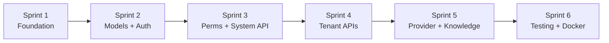

# CMS Backend — Sprint Overview

## Timeline

```
Sprint 1 ─── Sprint 2 ─── Sprint 3 ─── Sprint 4 ─── Sprint 5 ─── Sprint 6
 3-4d          3-4d          3-4d          4-5d          4-5d          2-3d
Foundation    Models+Auth   Perms+System  Tenant APIs   Provider+KB   Testing
                                                                     ~20-25 ngày
```

## Sprint Summary

| Sprint | Tên | Duration | Focus |
|---|---|---|---|
| 1 | [Foundation](sprint-1-foundation.md) | 3-4d | Project setup, core infra (DB, Redis, settings), base models, Alembic, utils |
| 2 | [Models + Auth](sprint-2-models-auth.md) | 3-4d | 27 DB models, migration, JWT cookie auth, seed data |
| 3 | [Permissions + System API](sprint-3-permissions-system-api.md) | 3-4d | Permission resolution engine, system admin CRUD, audit logging |
| 4 | [Tenant APIs](sprint-4-tenant-apis.md) | 4-5d | Tenant routing, CRUD (user, group, agent, MCP, permission) |
| 5 | [Provider + Knowledge](sprint-5-provider-knowledge.md) | 4-5d | Key rotation, folder/doc management, Milvus indexing, permission-filtered search |
| 6 | [Testing + Docker](sprint-6-testing-docker.md) | 2-3d | Test suite, Dockerfile, docker-compose, documentation |

## Dependency Graph



## Key Deliverables per Sprint

| Sprint | DB Tables | API Endpoints | Key Files |
|---|---|---|---|
| 1 | 0 | 0 | config/, core/, common/, cache/, utils/ |
| 2 | 27 tables | 5 (auth) | models/*, schemas/auth, services/auth |
| 3 | — | ~20 (system) | services/permission, api/v1/system/* |
| 4 | — | ~30 (tenant) | middleware, api/v1/tenant/* |
| 5 | — | ~15 (provider+kb) | services/provider, services/knowledge, workers/ |
| 6 | — | — | tests/*, Dockerfile, docker-compose |
