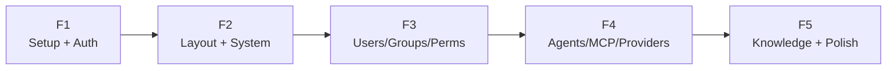

# CMS Frontend — Implementation Plan

## 1. Overview

Admin dashboard tại `multi-agent/frontend/` — quản lý orgs, users, agents, MCP, providers, knowledge base. Gọi CMS backend API (port 8002), **không chứa backend code**.

> [!CAUTION]
> ## Quy tắc bắt buộc
> **Backend:** Router thin, TTL tập trung (`settings.py`), Redis cache + invalidation, invite-only, token blacklist = Redis TTL, schema riêng file, service singleton.
>
> **Frontend:**
> 1. **Datetime UTC** — Dùng `lib/datetime.ts`. Backend trả UTC → `formatDateTime()`, `formatRelativeTime()`, `toUTC()`.
> 2. **UI rendering theo permission** — `GET /permissions/me` → `PermissionGate` wrap tất cả sensitive UI.
> 3. **Multi-tenant routing** — Dev: `/t/{tenant_id}/`, Prod: subdomain.
> 4. **Invite-only** — KHÔNG có form đăng ký. Chỉ login + accept-invite.
> 5. **i18n** — Tất cả text dùng translation keys (en/vi). KHÔNG hardcode string.
> 6. **OrgSwitcher** — Chuyển org → re-fetch permissions → re-render.
> 7. **API calls** — Gọi CMS backend. KHÔNG chứa backend code trong frontend.
> 8. **Code structure separation** — KHÔNG define inline. Phải tách đúng vị trí:
>    - `types/models.ts` — Entity types + Create/Update DTOs
>    - `types/api.ts` — API response wrappers (PaginatedResponse, ErrorResponse)
>    - `lib/api/{domain}.ts` — API functions per domain (system, tenant, permissions)
>    - `hooks/use-{feature}.ts` — Data fetching hooks, import từ `lib/api/` + `types/`
>    - Pages (`.tsx`) — Thin: chỉ import types, API functions, hooks, components. KHÔNG define interface/type/api call inline.
> 9. **Component granularity** — Chia nhỏ component nhất có thể để tái sử dụng. KHÔNG lồng gộp nhiều concerns vào 1 component. Mỗi component chỉ làm 1 việc (Single Responsibility). VD: `DataTableToolbar`, `StatusBadge`, `ActionDropdown` phải là component riêng, không gộp vào page.
>
> ### 🔴 Permission System (HOTFIX — vi phạm gây lỗi bảo mật/UX)
> 10. **X-Org-Id header** — `api-client.ts` tự gửi `X-Org-Id` trên mọi request. KHÔNG truyền org_id qua query param. `OrgContext.switchOrg()` sync `api.setOrgId()`.
> 11. **Superuser bypass** — `PermissionGate` bypass `hasPermission` cho superuser. Backend `check_permission()` return `(True, "superuser")`.
> 12. **PermissionGate loading guard** — Check `isLoading` TRƯỚC khi deny. Nếu không sẽ flash "Access Denied" khi vừa mount.
> 13. **fetchUIPermissions()** — KHÔNG truyền tham số. Org context gửi qua header tự động.

### Key Architecture Points

| # | Point |
|---|---|
| 1 | **Invite-only** — không có form đăng ký, chỉ login + accept-invite |
| 2 | **UI components driven by backend permissions** — sidebar items, page access, actions đều kiểm tra từ `get_ui_permissions(user_id, org_id)` response |
| 3 | **Multi-tenant routing** — dev: path-based `/t/{tenant_id}/...`, prod: subdomain `{slug}.domain.com` |
| 4 | **OrgSwitcher** — user chọn org từ memberships → tất cả tenant API calls dùng org_id này |
| 5 | **PermissionGate** component — conditionally render children theo permission codename |

### Tech Stack (kế thừa từ `web/`)

| Layer | Technology |
|---|---|
| Framework | **Next.js 16** (App Router, Turbopack) |
| Styling | **TailwindCSS 4** + CSS Variables (dark/light) |
| Components | **Radix UI** + CVA (class-variance-authority) |
| Icons | **Lucide React** |
| Fonts | Geist Sans/Mono + Space Grotesk |
| Theme | **next-themes** (system/light/dark) |
| i18n | **next-intl** (en default, vi — extensible to ja/kr) |
| Auth | **JWT HttpOnly cookie** (POST to CMS backend, cookies auto-sent) |
| Data fetching | **SWR** (client-side) + `fetch` (server-side) |
| Forms | **React Hook Form** + **Zod** |
| Toast | **Sonner** |
| Tables | **@tanstack/react-table** |
| Motion | **motion** (framer-motion) |
| Charts | **Recharts** |

### Components Reused from `web/`

| Component | File | Notes |
|---|---|---|
| `Button` | `ui/button.tsx` | CVA variants: default, destructive, outline, ghost, etc. |
| `Dialog` | `ui/dialog.tsx` | Radix dialog |
| `DropdownMenu` | `ui/dropdown-menu.tsx` | Radix dropdown |
| `Card` | `ui/card.tsx` | Card container |
| `Input` | `ui/input.tsx` | Form input |
| `Label` | `ui/label.tsx` | Form label |
| `Textarea` | `ui/textarea.tsx` | Text area |
| `Switch` | `ui/switch.tsx` | Toggle switch |
| `Badge` | `ui/badge.tsx` | Status badges |
| `Separator` | `ui/separator.tsx` | Divider |
| `Sheet` | `ui/sheet.tsx` | Mobile slide-over |
| `Sidebar` | `ui/sidebar.tsx` | 617-line full sidebar system |
| `Tooltip` | `ui/tooltip.tsx` | Tooltips |
| `Sonner` | `ui/sonner.tsx` | Toast notifications |
| `AlertDialog` | `ui/alert-dialog.tsx` | Confirm dialogs |
| `Collapsible` | `ui/collapsible.tsx` | Collapsible sections |
| `ThemeProvider` | `theme-provider.tsx` | next-themes wrapper |
| `ThemeToggle` | `theme-toggle.tsx` | System/Light/Dark switcher |
| `cn()` | `lib/utils.ts` | clsx + tailwind-merge |
| `globals.css` | Full design token system | CSS vars for both themes |

### New Components for CMS

| Component | Purpose |
|---|---|
| `DataTable` | Generic CRUD table with sorting, filtering, pagination |
| `PageHeader` | Page title + breadcrumb + actions |
| `EmptyState` | Empty list/no data placeholder |
| `StatusBadge` | Color-coded status (active/inactive/pending) |
| `ConfirmDialog` | Delete confirmation wrapper |
| `SearchInput` | Debounced search input |
| `LocaleSwitcher` | Language toggle (en/vi) |
| `UserNav` | User menu (profile, org switch, logout) |
| `OrgSwitcher` | Organization selector |
| `PermissionGate` | Conditional render by permission |

---

## 2. Project Structure

```
multi-agent/frontend/
├── package.json
├── next.config.ts
├── tsconfig.json
├── postcss.config.mjs
├── tailwind.config.ts        # (nếu cần extend)
│
├── messages/                  # i18n translations
│   ├── en.json
│   └── vi.json
│
├── public/
│   └── icons/
│
└── src/
    ├── app/
    │   ├── globals.css        # Copy từ web/ (design tokens)
    │   ├── layout.tsx         # Root: ThemeProvider + IntlProvider
    │   ├── page.tsx           # → redirect /dashboard
    │   │
    │   ├── (auth)/            # Auth layout (no sidebar)
    │   │   ├── layout.tsx
    │   │   ├── login/page.tsx
    │   │   ├── accept-invite/page.tsx  # Nhận invite → set password
    │   │   └── forgot-password/page.tsx
    │   │
    │   └── (dashboard)/       # Dashboard layout (sidebar + topbar)
    │       ├── layout.tsx     # SidebarProvider + TopBar + UserNav
    │       ├── dashboard/page.tsx
    │       │
    │       ├── organizations/
    │       │   ├── page.tsx           # List orgs
    │       │   └── [orgId]/
    │       │       ├── page.tsx       # Org detail
    │       │       ├── users/page.tsx
    │       │       ├── groups/page.tsx
    │       │       ├── agents/page.tsx
    │       │       ├── mcp-servers/page.tsx
    │       │       ├── providers/page.tsx
    │       │       ├── knowledge/page.tsx
    │       │       ├── permissions/page.tsx
    │       │       └── audit-logs/page.tsx
    │       │
    │       ├── system/               # Superuser-only
    │       │   ├── agents/page.tsx
    │       │   ├── providers/page.tsx
    │       │   ├── mcp-servers/page.tsx
    │       │   └── settings/page.tsx
    │       │
    │       └── profile/page.tsx
    │
    ├── components/
    │   ├── ui/                # Copy từ web/ (19 primitives)
    │   ├── layout/            # TopBar, AppSidebar, OrgSwitcher, UserNav
    │   ├── data-table/        # Generic DataTable + columns
    │   ├── forms/             # Reusable form components
    │   └── shared/            # PageHeader, EmptyState, StatusBadge, etc.
    │
    ├── lib/
    │   ├── utils.ts           # cn() — copy from web/
    │   ├── api-client.ts      # fetch wrapper → CMS backend
    │   ├── auth.ts            # login/logout/refresh (JWT cookie)
    │   └── constants.ts       # API_BASE_URL, error code map
    │
    ├── hooks/
    │   ├── use-mobile.ts      # Copy from web/
    │   ├── use-auth.ts        # JWT auth state
    │   ├── use-current-org.ts # Current org context
    │   └── use-permissions.ts # Permission checks
    │
    ├── contexts/
    │   ├── auth-context.tsx
    │   └── org-context.tsx
    │
    ├── i18n/
    │   ├── request.ts         # next-intl server config
    │   └── routing.ts         # locale routing
    │
    └── types/
        ├── api.ts             # API response types
        ├── models.ts          # Entity types (User, Org, Agent...)
        └── auth.ts            # Auth types
```

---

## 3. Sprint Plan

### Sprint F1: Project Setup & Auth (3-4 ngày)
Init project, copy design system, i18n setup, JWT login/logout, auth middleware.

### Sprint F2: Dashboard Layout & System Pages (3-4 ngày)
Sidebar, topbar, org switcher, DataTable component, system CRUD pages (orgs, agents, providers, MCP, settings).

### Sprint F3: Tenant Pages — Users, Groups, Permissions (3-4 ngày)
Org-scoped pages: user management, group management, permission assignment/check UI.

### Sprint F4: Tenant Pages — Agents, MCP, Providers (3-4 ngày)
Agent config, MCP server + tool CRUD, provider key management, agent↔provider mapping.

### Sprint F5: Knowledge Base & Polish (3-4 ngày)
Folder tree, document upload/index, audit logs, dashboard analytics, final polish.

---

## 4. Dependency Graph



## 5. Key Deliverables

| Sprint | Pages | Key Components |
|---|---|---|
| F1 | Login, Forgot Password | AuthProvider, api-client, i18n |
| F2 | Dashboard, System CRUD (4) | Sidebar, TopBar, DataTable, OrgSwitcher |
| F3 | Org Users, Groups, Permissions | PermissionGate, role badges, assign UI |
| F4 | Agents, MCP, Providers | Agent config forms, key rotation UI |
| F5 | Knowledge, Audit, Dashboard charts | File upload, folder tree, Recharts |
