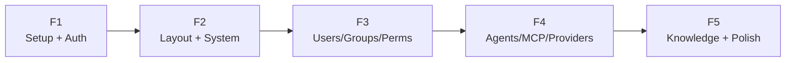

# CMS Frontend — Sprint Overview

## Timeline

```
Sprint F1 ─── Sprint F2 ─── Sprint F3 ─── Sprint F4 ─── Sprint F5
  3-4d          3-4d          3-4d          3-4d          3-4d
Setup+Auth    Layout+Sys    Users/Perms   Agent/MCP     Knowledge
                                                        ~15-20 ngày
```

## Sprint Summary

| Sprint | Tên | Duration | Focus |
|---|---|---|---|
| F1 | [Setup + Auth](sprint-f1-setup-auth.md) | 3-4d | Project init, copy design system, i18n, JWT auth, middleware |
| F2 | [Layout + System](sprint-f2-layout-system.md) | 3-4d | Dashboard layout, sidebar, DataTable, system admin CRUD |
| F3 | [Users/Groups/Permissions](sprint-f3-users-groups-perms.md) | 3-4d | Org user CRUD, group management, permission assignment |
| F4 | [Agents/MCP/Providers](sprint-f4-agents-mcp-providers.md) | 3-4d | Agent config, MCP+tool CRUD, provider key management |
| F5 | [Knowledge + Polish](sprint-f5-knowledge-polish.md) | 3-4d | Folder tree, document upload, audit logs, dashboard charts |

## Dependency Graph



## Key Deliverables

| Sprint | Pages | New Components | API Endpoints Used |
|---|---|---|---|
| F1 | Login | AuthProvider, api-client, i18n setup | `/auth/*` |
| F2 | Dashboard, System (4 pages) | AppSidebar, TopBar, DataTable, OrgSwitcher | `/system/*` |
| F3 | Org Users, Groups, Permissions | PermissionGate, role assign | `/t/{id}/users,groups,permissions` |
| F4 | Agents, MCP, Providers | Agent config, key rotation UI | `/t/{id}/agents,mcp-servers,providers` |
| F5 | Knowledge, Audit, Dashboard | FolderTree, FileUpload, Recharts | `/t/{id}/knowledge,audit-logs` |
